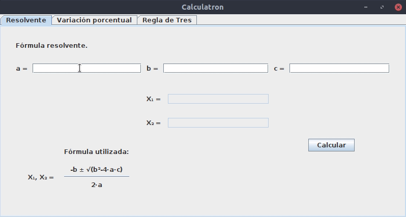
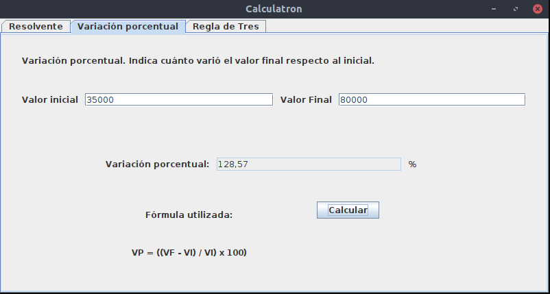

## Calculatron
### Una calculadora visualmente fea pero muy útil

Es una calculadora que en algún momento hice, pero como la mayoría de los SO y distribuciones ya traen sus calculadoras, decidí hacer que resuelva fórmulas un poco más complejas (ponele).

Está hecha con Java y Swing (still alive). [Podés ver como funciona acá](src/com/calculatron).

Si, ya sé. Es horrible. Pero ayudó a más estudiantes de los que imaginás.

## Qué puede hacer
* Fórmula resolvente
* Fórmula de variación porcentual
* Regla de 3 simple

## TODO
* Hacer que sea menos horrible (Quizás implementando JavaFX como si estuviésemos en 2020 y no Swing como si fuese 1995)
* Agregar más funciones
